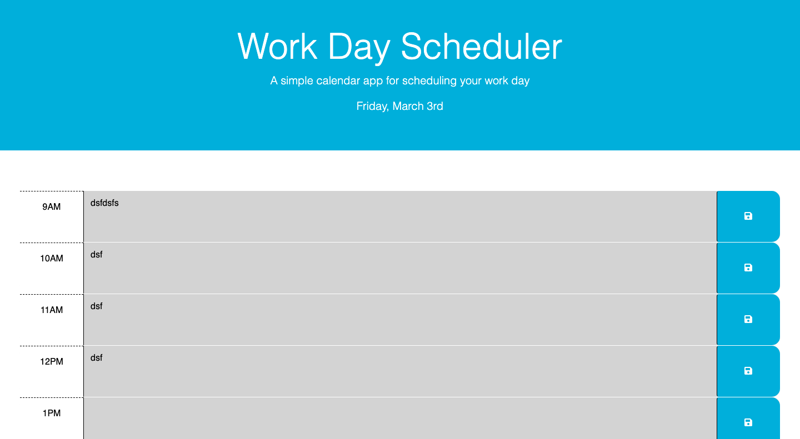

# Work Day Scheduler

This project was to create a simple calendar application that allows a user to save events for each hour of the day.

The web application utilizes JQuery, DayJS, and LocalStorage. Starter code was provided for this project. Its HTML and CSS is dynamically updated powered ny JQuery. We were tasked with displaying the current time at the top. Each hour block is color-coded to indicate whether it is in the past, present, or future. Each item content when saved, updates data saved to LocalStorage.

[Link to working example](https://xclusive36.github.io/WorkScheduler/)

(st, nd, rd, th): from https://stackoverflow.com/questions/15397372/javascript-new-date-ordinal-st-nd-rd-th